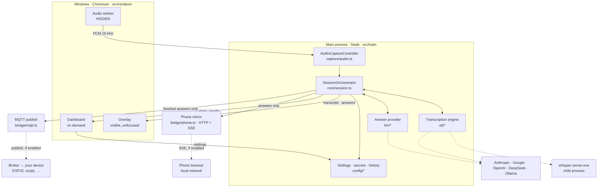
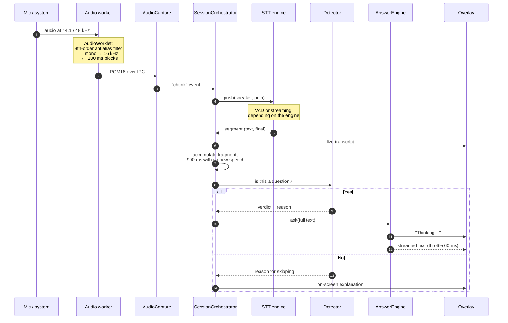
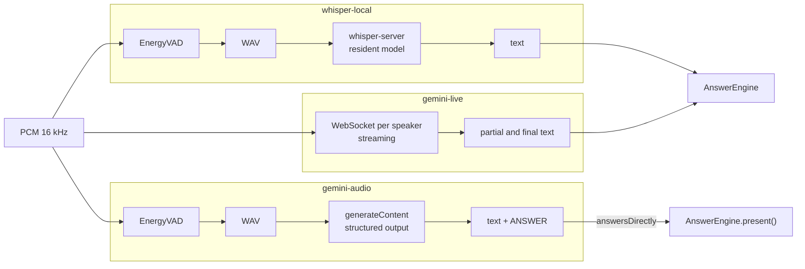
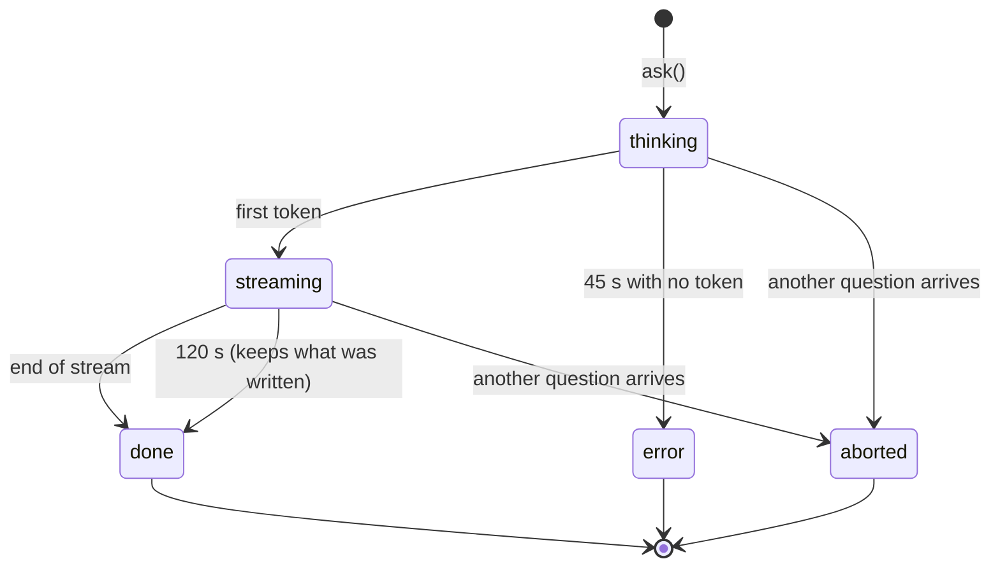
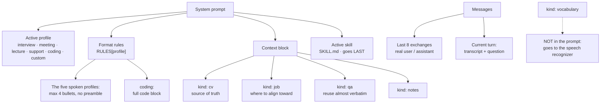
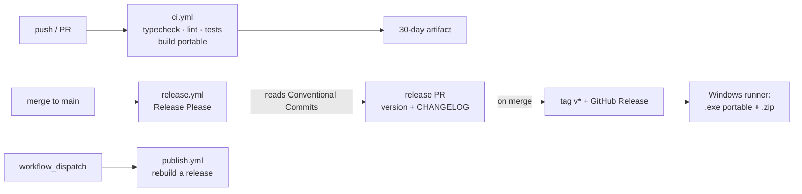

# ARCHITECTURE.md — what the system is and how data flows

This document is the **map**. It answers "where does this live?" and "what
happens when someone speaks?".

It doesn't explain **why** the decisions are what they are —that's in
[CONTEXT.md](CONTEXT.md), required reading before changing anything that looks
odd— nor **how to use** the app, which is in [USAGE.md](USAGE.md).

---

## 1. The processes

Electron splits the work between a main process with Node access and several
isolated windows. There are **three windows** and a couple of child processes.



**The phone mirror hooks into the `broadcast()` calls**, not into each emitter:
what the overlay sees is what the phone can see, and it filters what's useful to
it —answers and capture state, never the transcript—. That way it doesn't fall
behind when someone adds a new event. It starts off and only listens on
`127.0.0.1` unless local-network access is allowed.

**Why the audio lives in a hidden window and not in main:** `getUserMedia` and
`getDisplayMedia` only exist in a renderer. Isolating it also keeps hiding the
overlay from stopping capture, and `backgroundThrottling: false` is essential or
Chromium throttles the timers of an unfocused window.

The three windows share **a single preload** (`src/preload/index.ts`). The
overlay and the dashboard simply ignore the `audioWorker` section of the API.

---

## 2. The path of a question

This is the flow to keep in your head. Everything else is support.



**The two points where waiting is decided** are what define the feel of the
app, and both are measured in CONTEXT.md:

| Wait | How long | What for |
|---|---|---|
| VAD silence | 700 ms | Consider the turn closed |
| Fragment accumulation | 900 ms | Not answer a half-finished hesitation |

They add up to ~1.6 s of silence before deciding. More than a pause of doubt,
less than the end of a question.

---

## 3. The three transcription engines, and the one that isn't

`STTProvider` (`src/main/stt/types.ts`) is the contract. Three implementations,
interchangeable from the dashboard:



`gemini-audio` is the odd one and it's worth understanding why: **it sends the
audio to the language model itself**, which returns transcription and answer in
the same call. It skips the whole text layer, so a bad transcription can no
longer spoil the answer — the model hears, it doesn't read.

That forces the orchestrator to know about it: the `answersDirectly` flag makes
the question detector **stay out of the way**, because whoever decides if
something deserved an answer is the model that heard the audio.

| Engine | Latency per turn | Where the audio goes | Gives transcript |
|---|---|---|---|
| `whisper-local` | ~825 ms | Nowhere | Yes |
| `gemini-live` | ~300 ms, streaming | To Google | Yes |
| `gemini-audio` | ~2 s, includes the answer | To Google | Yes |
| `openai-live` | ~300 ms, streaming | To OpenAI | Yes |
| `openai-transcribe` | ~1 s, closed turn | To OpenAI | Yes |

**`openai-live` resamples to 24 kHz** because OpenAI's real-time API accepts
nothing else, while the rest of the pipeline runs at 16 kHz. The conversion
lives in `stt/resample.ts`, contained in the only engine that needs it;
CONTEXT.md explains why linear interpolation is enough there and why the state
between blocks isn't optional.

---

## 4. Lifecycle of an answer

`AnswerEngine` (`core/answer-engine.ts`) guarantees **a single answer in
flight**. If a new question arrives, the previous one is aborted: a stale answer
is worse than none, because it gets read out and answers something that already
passed.



The two clocks tell "the provider doesn't start" apart from "it doesn't finish",
which produce the same blank screen but are fixed in different ways.

Only turns that reach `done` **with text** enter the conversation memory: an
aborted answer isn't something the model said.

**"Continue" doesn't open a new answer, it extends the same one.** A code
solution may not fit in a single call's cap; `continueAnswer` reopens the answer
in `done` with its **same id**, seeds its text and lets `consume` —which appends
to `this.current.text`— glue the continuation onto the end. Since the overlay
and the phone update by id, they watch a single solution grow. The partial
already travels as the assistant's last turn (`remember` put it there), so all
that's asked is "keep going from where you were cut off, without repeating".

---

## 5. What reaches the model on each query



**The three pieces of the system prompt answer different questions**, and
confusing them is what makes one of them go unnoticed:

| | What it adds | Example |
|---|---|---|
| Profile | The **shape** of the answer | 4 bullets · code block · one line per question |
| Context pack | The **material** | The CV, the job offer, prepared answers |
| Skill | The **way** of writing | Which words to avoid, what rhythm, what tone |

That's why a skill **adds to** the profile instead of replacing it, and why it
goes last in the prompt with its precedence written out: it rules over the way,
and the profile still rules over the shape. See `skillBlock` in `core/prompt.ts`.

Two things that aren't obvious:

- **Each context pack's `kind` changes the instruction**, not just the label. A
  prepared answer is reused; a CV is the only source of concrete facts about the
  person; a job offer steers the discourse but doesn't allow attributing
  experience. Without that distinction, prepared material came out paraphrased
  and watered down.
- **The conversation history travels as real messages**, not summarized inside
  the prompt. That's what makes the model treat its own previous answers as
  things it said.
- **`RULES` is a profile → rules map, not a constant.** `coding` is the only one
  that **replaces** the format rules instead of inheriting them: the four
  bullets exist because the answer is read out of the corner of your eye, and an
  algorithm isn't read, it's copied.

---

## 5 bis. The screen actions

Two buttons —code and quiz— that share a path and enter the same `AnswerEngine`.
They're the only triggers that change **how** the answer is produced and with
**which model**, not just what is asked.

```mermaid
sequenceDiagram
    autonumber
    participant K as Ctrl+Alt+C / Ctrl+Alt+Q
    participant S as SessionOrchestrator
    participant C as captureScreen
    participant A as AnswerEngine
    participant M as screenModelFor
    participant O as Overlay

    K->>S: solveOnScreen('code' | 'quiz')
    S->>C: captureScreen({ forCode: true })
    C-->>S: JPEG q92 · 1600 px
    S->>A: attachImage + ask(task, SOLVE_INSTRUCTION[task])
    A->>M: which model solves the screen?
    M-->>A: provider + model (or the usual, if `same`)
    Note over A: forced coding/quiz profile<br/>maxTokens 2200 only for code<br/>no vision → error, not an answer
    A-->>O: streaming
    Note over O: parseAnswerBlocks:<br/>``` fences → &lt;pre&gt; + Copy
```

| Task | Profile | Cap | Answer shape |
|---|---|---|---|
| `code` | `coding` | 2200 | Approach + full code + 3 notes |
| `quiz` | `quiz` | 700 | The option, alone, on the first line |

Four decisions that aren't visible in the diagram:

| What | Why |
|---|---|
| It doesn't go through `ask('hotkey')` | The prompt is on the screen, not in the audio: taking the last utterance as the question would drop a stray sentence competing with it |
| It works with listening stopped | The normal case is an exercise in front of you and no call open |
| It forces the profile without persisting it | You solve the screen mid-interview and the next spoken question still comes out in bullets |
| With no capture, it does **not** ask | Unlike `Ctrl+Shift+S`: with no image there's no prompt to read |
| They can use **another model** | Conversing needs latency; reading a capture needs vision. `screenModelFor` decides, and with `same` everything stays as before |

**Chunk capture is a third screen action**, for a prompt that's revealed by
scrolling on a shared screen and doesn't fit in a single capture. Instead of
capture-and-solve, it **accumulates**: `onCaptureHotkey` (`core/session.ts`)
stacks frames in `captureStack` —`Ctrl+Alt+A`, and in automatic mode a loop with
`captureScreenFrame`—, and `solveCaptureStack` attaches them all with
`attachImage` and asks once with `SCROLL_SOLVE_INSTRUCTION`. There's nothing new
downstream: `AnswerEngine.pendingImages` **was already an array** and the four
vision providers already iterate over `request.images`. Automatic mode
deduplicates near-identical frames with a perceptual `aHash`
(`capture/frame-hash.ts`), and the stack state travels to the overlay chip via
`onScrollCapture`.

---

## 6. Where the state lives

Everything under `%APPDATA%\interview-helper` (`app.getPath('userData')`).

| Path | What it is | Format |
|---|---|---|
| `settings.json` | All the configuration | JSON, tolerates BOM |
| `secrets.json` | API keys encrypted with DPAPI | JSON, **never reaches the renderer** |
| `conversations/*.json` | History, one per conversation | JSON, atomic writes |
| `skills/<id>/SKILL.md` | User skills | Markdown with frontmatter |
| `logs/main.log` | Main process log | Text, rotates at 1 MB |
| `whisper/` | Binaries and GGML models | Downloaded on demand |

**Don't change the `name` field in `package.json`.** `app.getPath('userData')`
derives from `app.name`, and breaking it orphans the settings and the encrypted
key. It's pinned with `app.setName('interview-helper')` at the start of
`main/index.ts`.

**The audio never touches the disk.** The only exception is the temporary WAV
that whisper-cli needs, deleted in the `finally` of each invocation. Text is
saved if history is on; see CONTEXT.md §4.

**And two outputs that aren't the disk:** with the phone mirror on, the answers
—not the transcript— are served over HTTP to the local network; with MQTT on,
each finished answer is published to a broker, which may be outside your
network. Nothing is persisted in either case. See CONTEXT.md §4.

---

## 7. The contracts

Three files concentrate everything that crosses a boundary. If you touch one,
TypeScript tells you what else has to change — which is exactly what they're for.

| File | Boundary | Rule |
|---|---|---|
| `shared/types.ts` | main ↔ renderer | If a type crosses the IPC, it lives here |
| `shared/accelerator.ts` | keyboard ↔ Electron | The format is dictated by `globalShortcut`, not the UI |
| `shared/model-guide.ts` | app ↔ browser | Pure `SystemSpecs → HTML` function; no scripts, no network |
| `shared/ipc.ts` | main ↔ renderer | The channel names, so they don't drift with a mistyped string |
| `stt/types.ts` | orchestrator ↔ engines | `STTProvider` |
| `llm/types.ts` | engine ↔ providers | `LLMProvider`, with a **mandatory** `AbortSignal` |

The preload (`src/preload/index.ts`) is the only bridge: `contextIsolation` is
on and `nodeIntegration` off, so the renderer only sees the methods that file
exposes. None of them can return an API key.

---

## 8. How to add things

**A new transcription engine** (Deepgram, Soniox…):

1. A file in `src/main/stt/` that implements `STTProvider`.
2. A `case` in the `switch` of `stt/index.ts` and a branch in `testSTTConnection`.
3. An id in `STTProviderId` (`shared/types.ts`) — the exhaustive `switch` makes
   the build fail until you handle it.
4. An `<option>` in the dashboard.

The orchestrator doesn't change.

**A new answer provider** (Groq, Mistral…):

1. A file in `src/main/llm/` that implements `LLMProvider`.
2. An entry in the `llm/index.ts` map and an id in `LLMProviderId`.
3. Render `request.history` as real messages, not inside the prompt.
4. If it carries a credential, a field in `SecretsPresence` — the `Record`
   forces `getPresence()` to return it and the dashboard to show it.

What the compiler **won't** warn you about, and you have to check by hand, is in
the ChatGPT list in
[CONTEXT.md](CONTEXT.md#lo-que-costó-añadir-chatgpt-y-no-era-el-proveedor): the
three screens that decide "is it configured?" with their own condition.

**A new skill:** no code to touch. A folder in
`%APPDATA%\interview-helper\skills` with a `SKILL.md` inside —frontmatter with
`name` and `description`, the body in Markdown— and "Reload" in the dashboard.
The built-in ones live in `main/skills/built-in.ts` and a folder with the same
id replaces them.

**A new prompt profile:** an entry in `PROFILES` (`core/prompt.ts`), its id in
`PromptProfileId`, its format rules in `RULES`, its slots in `PROFILE_SLOTS` and
an `<option>`. The three maps are `Record<PromptProfileId, …>` on purpose:
adding the id without deciding the rest breaks the build.

---

## 9. Verification and publishing



Two traps that cost an afternoon and are documented in CONTEXT.md §12:

- **No Conventional Commits, no release**, and the workflow ends green. A
  `feat:`/`fix:` is what triggers everything; a free-form message is silently
  ignored.
- **GitHub forbids Actions from creating pull requests by default.** With that
  option off, Release Please computes the version, generates the CHANGELOG,
  creates the branch... and dies at the last step.

The local verification commands:

```bash
npm run typecheck && npm run lint && npm test
```

---

## 10. File map

| Path | Responsibility |
|---|---|
| `main/index.ts` | Startup, IPC handlers, lifecycle |
| `main/core/session.ts` | The orchestrator: joins audio, STT and answers |
| `main/core/answer-engine.ts` | A single answer in flight, memory, streaming |
| `main/core/question-detector.ts` | Heuristic for "does this need an answer?" |
| `main/core/vad.ts` | Energy segmentation with an adaptive floor |
| `main/core/prompt.ts` | System prompt assembly |
| `main/core/transcript-buffer.ts` | Rolling window of the conversation |
| `main/capture/audio.ts` | Bridge with the hidden capture window |
| `main/stt/*` | The three engines and the Whisper assets |
| `main/llm/*` | Claude, Gemini, ChatGPT, DeepSeek, Ollama |
| `main/config/*` | Settings, DPAPI secrets, history |
| `main/bridge/*` | Outward outputs: phone mirror (HTTP + SSE) and MQTT publishing |
| `main/skills/*` | Loading the user's SKILL.md files and the built-in one |
| `main/setup/*` | What the wizard installs on its own: Ollama via winget and model downloads |
| `main/windows/*` | Windows, stealth, manual dragging |
| `main/logging.ts` | File log of the main process |
| `main/system-specs.ts` | RAM, CPU and GPU, to recommend a local model |
| `renderer/audio-worker/pcm-worklet.ts` | Antialias filter and resampling, on the audio thread |
| `shared/answer-format.ts` | Splits the answer into text and code blocks; used by the overlay and the phone mirror |
| `renderer/overlay/*` | The floating panel |
| `renderer/dashboard/*` | Settings, history, diagnostics |
| `shared/*` | Types and IPC channels |
