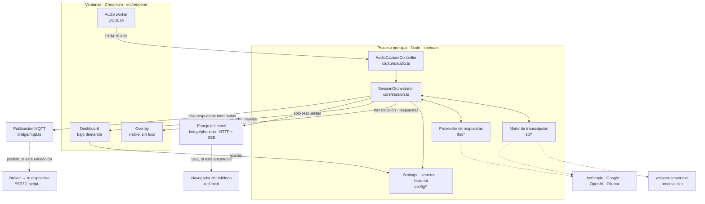
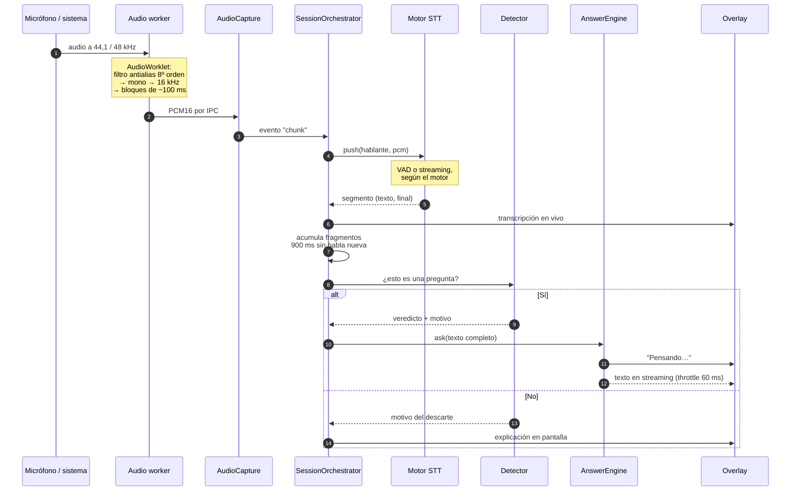
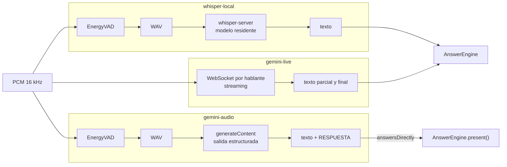
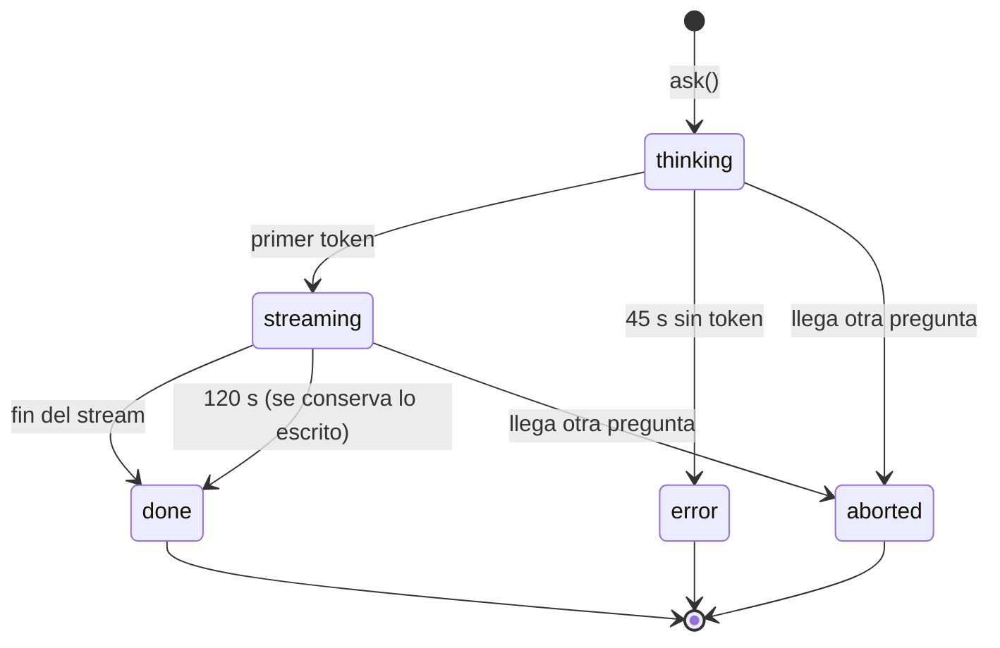
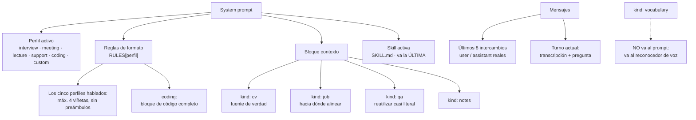
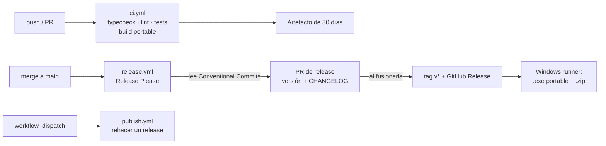

# ARCHITECTURE.md — qué es el sistema y cómo circulan los datos

Este documento es el **mapa**. Responde a "¿dónde vive esto?" y "¿qué pasa
cuando alguien habla?".

No explica **por qué** las decisiones son las que son —eso está en
[CONTEXT.md](CONTEXT.md), y es lectura obligatoria antes de cambiar algo que
parezca raro— ni **cómo se usa** la app, que está en el [README](README.md).

---

## 1. Los procesos

Electron reparte el trabajo en un proceso principal con acceso a Node y varias
ventanas aisladas. Aquí hay **tres ventanas** y un par de procesos hijos.



**El espejo del móvil se engancha a los `broadcast()`**, no a cada emisor: lo
que ve el overlay es lo que puede ver el teléfono, y él filtra lo que le sirve
—respuestas y estado de la captura, nunca la transcripción—. Así no se queda
atrás cuando alguien añade un evento nuevo. Empieza apagado y sólo escucha en
`127.0.0.1` salvo que se le permita la red local.

**Por qué el audio vive en una ventana oculta y no en el main:**
`getUserMedia` y `getDisplayMedia` sólo existen en un renderer. Aislarlo además
evita que ocultar el overlay pare la captura, y `backgroundThrottling: false`
es imprescindible o Chromium estrangula los timers de una ventana sin foco.

Las tres ventanas comparten **un solo preload** (`src/preload/index.ts`). El
overlay y el dashboard simplemente ignoran la sección `audioWorker` del API.

---

## 2. El recorrido de una pregunta

Éste es el flujo que hay que tener en la cabeza. Todo lo demás es soporte.



**Los dos puntos donde se decide esperar** son los que definen la sensación de
la app, y ambos están medidos en CONTEXT.md:

| Espera | Cuánto | Para qué |
|---|---|---|
| Silencio del VAD | 700 ms | Dar el turno por cerrado |
| Acumulación de fragmentos | 900 ms | No responder a un titubeo a medias |

Suman ~1,6 s de silencio antes de decidir. Más que una pausa de duda, menos que
el final de una pregunta.

---

## 3. Los tres motores de transcripción, y el que no lo es

`STTProvider` (`src/main/stt/types.ts`) es el contrato. Tres implementaciones,
intercambiables desde el dashboard:



`gemini-audio` es el raro y conviene entender por qué: **manda el audio al
propio modelo de lenguaje**, que devuelve transcripción y respuesta en la misma
llamada. Se salta la capa de texto entera, así que una transcripción mala deja
de poder estropear la respuesta — el modelo oye, no lee.

Eso obliga a que el orquestador lo sepa: el flag `answersDirectly` hace que el
detector de preguntas **no intervenga**, porque quien decide si algo merecía
respuesta es el modelo que oyó el audio.

| Motor | Latencia por turno | Dónde va el audio | Da transcripción |
|---|---|---|---|
| `whisper-local` | ~825 ms | A ningún sitio | Sí |
| `gemini-live` | ~300 ms, en streaming | A Google | Sí |
| `gemini-audio` | ~2 s, incluye la respuesta | A Google | Sí |

---

## 4. Ciclo de vida de una respuesta

`AnswerEngine` (`core/answer-engine.ts`) garantiza **una sola respuesta en
vuelo**. Si llega una pregunta nueva, la anterior se aborta: una respuesta
obsoleta es peor que ninguna, porque se lee y se contesta a algo que ya pasó.



Los dos relojes distinguen "el proveedor no arranca" de "no termina", que
producen la misma pantalla en blanco pero se arreglan de forma distinta.

Sólo los turnos que llegan a `done` **con texto** entran en la memoria de la
conversación: una respuesta abortada no es algo que el modelo dijera.

---

## 5. Qué llega al modelo en cada consulta



**Las tres piezas del system prompt responden a preguntas distintas**, y
confundirlas es lo que hace que una de ellas no se note:

| | Qué aporta | Ejemplo |
|---|---|---|
| Perfil | La **forma** de la respuesta | 4 viñetas · bloque de código · una línea por pregunta |
| Context pack | El **material** | El CV, la oferta, respuestas preparadas |
| Skill | La **manera** de escribir | Qué palabras evitar, qué ritmo, qué tono |

Por eso una skill **se suma** al perfil en vez de sustituirlo, y por eso va la
última del prompt con su precedencia escrita: manda sobre la manera, y el perfil
sigue mandando sobre la forma. Ver `skillBlock` en `core/prompt.ts`.

Dos cosas que no son obvias:

- **El `kind` de cada context pack cambia la instrucción**, no sólo la etiqueta.
  Una respuesta preparada se reutiliza; un CV es la única fuente de datos
  concretos sobre la persona; una oferta orienta el discurso pero no permite
  atribuir experiencia. Sin esa distinción, el material preparado salía
  parafraseado y aguado.
- **El historial de la conversación viaja como mensajes de verdad**, no
  resumido dentro del prompt. Es lo que hace que el modelo trate sus respuestas
  anteriores como cosas que dijo él.
- **`RULES` es un mapa perfil → reglas, no una constante.** `coding` es el único
  que **sustituye** las reglas de formato en vez de heredarlas: las cuatro
  viñetas existen porque la respuesta se lee de reojo, y un algoritmo no se lee,
  se copia.

---

## 5 bis. Las acciones de pantalla

Dos botones —código y test— que comparten camino y entran al mismo
`AnswerEngine`. Son los únicos disparos que cambian **cómo** se responde y con
**qué modelo**, no sólo qué se pregunta.

```mermaid
sequenceDiagram
    autonumber
    participant K as Ctrl+Alt+C / Ctrl+Alt+Q
    participant S as SessionOrchestrator
    participant C as captureScreen
    participant A as AnswerEngine
    participant M as screenModelFor
    participant O as Overlay

    K->>S: solveOnScreen('code' | 'quiz')
    S->>C: captureScreen({ forCode: true })
    C-->>S: JPEG q92 · 1600 px
    S->>A: attachImage + ask(task, SOLVE_INSTRUCTION[task])
    A->>M: ¿qué modelo resuelve la pantalla?
    M-->>A: proveedor + modelo (o el de siempre, si `same`)
    Note over A: perfil forzado coding/quiz<br/>maxTokens 2200 sólo en código<br/>sin visión → error, no respuesta
    A-->>O: streaming
    Note over O: parseAnswerBlocks:<br/>vallas ``` → &lt;pre&gt; + Copiar
```

| Tarea | Perfil | Tope | Forma de la respuesta |
|---|---|---|---|
| `code` | `coding` | 2200 | Enfoque + código completo + 3 apuntes |
| `quiz` | `quiz` | 700 | La opción, sola, en la primera línea |

Cuatro decisiones que no se ven en el diagrama:

| Qué | Por qué |
|---|---|
| No pasa por `ask('hotkey')` | El enunciado está en la pantalla, no en el audio: coger la última intervención como pregunta metería una frase suelta compitiendo con él |
| Funciona con la escucha parada | El caso normal es un ejercicio delante y ninguna llamada abierta |
| Fuerza el perfil sin persistirlo | Se resuelve la pantalla en mitad de una entrevista y la siguiente pregunta hablada sigue saliendo en viñetas |
| Sin captura, **no** pregunta | Al revés que `Ctrl+Shift+S`: sin imagen no hay enunciado que leer |
| Pueden usar **otro modelo** | Conversar pide latencia; leer una captura pide vista. `screenModelFor` decide, y con `same` todo queda como antes |

---

## 6. Dónde vive el estado

Todo bajo `%APPDATA%\interview-helper` (`app.getPath('userData')`).

| Ruta | Qué es | Formato |
|---|---|---|
| `settings.json` | Toda la configuración | JSON, tolera BOM |
| `secrets.json` | API keys cifradas con DPAPI | JSON, **nunca sale al renderer** |
| `conversations/*.json` | Historial, uno por conversación | JSON, escritura atómica |
| `skills/<id>/SKILL.md` | Skills del usuario | Markdown con frontmatter |
| `logs/main.log` | Registro del proceso principal | Texto, rota a 1 MB |
| `whisper/` | Binarios y modelos GGML | Descargados bajo demanda |

**No cambiar el campo `name` de `package.json`.** `app.getPath('userData')`
deriva de `app.name`, y romperlo deja huérfanos los settings y la key cifrada.
Está anclado con `app.setName('interview-helper')` al inicio de `main/index.ts`.

**El audio nunca toca el disco.** La única excepción es el WAV temporal que
whisper-cli necesita, que se borra en el `finally` de cada invocación. El texto
sí se guarda si el historial está activo; ver CONTEXT.md §4.

**Y dos salidas que no son disco:** con el espejo del móvil encendido, las
respuestas —no la transcripción— se sirven por HTTP a la red local; con MQTT
encendido, cada respuesta terminada se publica en un broker, que puede estar
fuera de tu red. Nada se persiste en ninguno de los dos casos. Ver CONTEXT.md §4.

---

## 7. Los contratos

Tres archivos concentran todo lo que cruza una frontera. Si tocas uno, TypeScript
te dice qué más hay que tocar — que es exactamente para lo que están.

| Archivo | Frontera | Regla |
|---|---|---|
| `shared/types.ts` | main ↔ renderer | Si un tipo cruza el IPC, vive aquí |
| `shared/accelerator.ts` | teclado ↔ Electron | El formato lo dicta `globalShortcut`, no la UI |
| `shared/model-guide.ts` | app ↔ navegador | Función pura `SystemSpecs → HTML`; sin scripts ni red |
| `shared/ipc.ts` | main ↔ renderer | Los nombres de canal, para que no se desincronicen con un string mal escrito |
| `stt/types.ts` | orquestador ↔ motores | `STTProvider` |
| `llm/types.ts` | motor ↔ proveedores | `LLMProvider`, con `AbortSignal` **obligatorio** |

El preload (`src/preload/index.ts`) es el único puente: `contextIsolation` está
activo y `nodeIntegration` desactivado, así que el renderer sólo ve los métodos
que ese archivo expone. Ninguno puede devolver una API key.

---

## 8. Cómo añadir cosas

**Un motor de transcripción nuevo** (Deepgram, Soniox…):

1. Un archivo en `src/main/stt/` que implemente `STTProvider`.
2. Un `case` en el `switch` de `stt/index.ts` y una rama en `testSTTConnection`.
3. Un id en `STTProviderId` (`shared/types.ts`) — el `switch` exhaustivo hace
   que el build falle hasta que lo manejes.
4. Una `<option>` en el dashboard.

El orquestador no cambia.

**Un proveedor de respuestas nuevo** (Groq, Mistral…):

1. Un archivo en `src/main/llm/` que implemente `LLMProvider`.
2. Entrada en el mapa de `llm/index.ts` y un id en `LLMProviderId`.
3. Renderizar `request.history` como mensajes reales, no dentro del prompt.
4. Si lleva credencial, un campo en `SecretsPresence` — el `Record` obliga a
   `getPresence()` a devolverlo y al dashboard a enseñarlo.

Lo que **no** avisa el compilador, y hay que mirar a mano, está en la lista de
ChatGPT en [CONTEXT.md](CONTEXT.md#lo-que-costó-añadir-chatgpt-y-no-era-el-proveedor):
las tres pantallas que deciden "¿está configurado?" con una condición propia.

**Una skill nueva:** no se toca código. Una carpeta en
`%APPDATA%\interview-helper\skills` con un `SKILL.md` dentro —frontmatter con
`name` y `description`, el cuerpo en Markdown— y «Recargar» en el dashboard. Las
de serie viven en `main/skills/built-in.ts` y una carpeta con su mismo id las
sustituye.

**Un perfil de prompt nuevo:** una entrada en `PROFILES` (`core/prompt.ts`), su
id en `PromptProfileId`, sus reglas de formato en `RULES`, sus huecos en
`PROFILE_SLOTS` y una `<option>`. Los tres mapas son `Record<PromptProfileId, …>`
a propósito: añadir el id sin decidir el resto rompe el build.

---

## 9. Verificación y publicación



Dos trampas que costaron una tarde y están documentadas en CONTEXT.md §12:

- **Sin Conventional Commits no hay release**, y el workflow termina en verde.
  Un `feat:`/`fix:` es lo que dispara todo; un mensaje libre se ignora en
  silencio.
- **GitHub prohíbe por defecto que Actions cree pull requests.** Con esa opción
  apagada, Release Please calcula la versión, genera el CHANGELOG, crea la
  rama... y muere en el último paso.

Los comandos de verificación local:

```bash
npm run typecheck && npm run lint && npm test
```

---

## 10. Mapa de archivos

| Ruta | Responsabilidad |
|---|---|
| `main/index.ts` | Arranque, handlers IPC, ciclo de vida |
| `main/core/session.ts` | El orquestador: une audio, STT y respuestas |
| `main/core/answer-engine.ts` | Una sola respuesta en vuelo, memoria, streaming |
| `main/core/question-detector.ts` | Heurística de "¿esto pide respuesta?" |
| `main/core/vad.ts` | Segmentación por energía con suelo adaptativo |
| `main/core/prompt.ts` | Ensamblado del system prompt |
| `main/core/transcript-buffer.ts` | Ventana rodante de la conversación |
| `main/capture/audio.ts` | Puente con la ventana oculta de captura |
| `main/stt/*` | Los tres motores y los assets de Whisper |
| `main/llm/*` | Claude, Gemini, ChatGPT, Ollama |
| `main/config/*` | Settings, secretos DPAPI, historial |
| `main/bridge/*` | Salidas hacia fuera: espejo del móvil (HTTP + SSE) y publicación MQTT |
| `main/skills/*` | Carga de los SKILL.md del usuario y la que viene de serie |
| `main/setup/*` | Lo que el asistente instala solo: Ollama vía winget y la descarga de modelos |
| `main/windows/*` | Ventanas, stealth, arrastre manual |
| `main/logging.ts` | Log a archivo del proceso principal |
| `main/system-specs.ts` | RAM, CPU y GPU, para recomendar un modelo local |
| `renderer/audio-worker/pcm-worklet.ts` | Filtro antialias y remuestreo, en el hilo de audio |
| `renderer/overlay/answer-format.ts` | Parte la respuesta en texto y bloques de código |
| `renderer/overlay/*` | El panel flotante |
| `renderer/dashboard/*` | Configuración, historial, diagnóstico |
| `shared/*` | Tipos y canales IPC |
