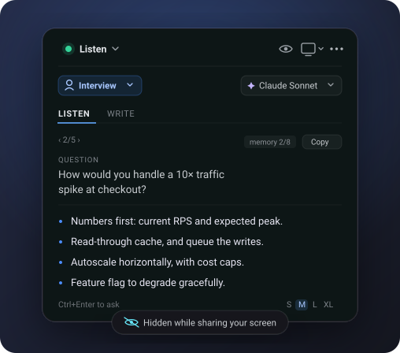

<div align="center">


# Tayori

**Real-time AI assistant for meetings and interviews.**

It listens to the call, transcribes who says what, and suggests answers in an
overlay that **stays invisible when you share your screen**.

[](LICENSE)
[](https://github.com/cflarios/Tayori/releases)
[](https://github.com/cflarios/Tayori/actions/workflows/ci.yml)




<sub>A stylized reproduction of the overlay.</sub>

</div>

---

Open source, MIT, no monetization. Everything runs on your machine and calls go
straight to the AI provider you pick — there is **no server in between**.

> **No audio is ever written to disk** — not even a temporary file. Audio chunks
> go to the transcription engine and are discarded on the spot. Only **text** is
> saved, and only if you leave history on: the assistant's answers and the
> conversation transcript, in a per-conversation JSON in your data folder. It
> never leaves your machine, and history can be turned off entirely.

## ✨ Highlights

- **Dual-source listening.** Your microphone and the system audio are captured
  separately, so it knows who is speaking without diarization.
- **Live transcription** with OpenAI (`gpt-live-transcribe`), Gemini Live
  (~300 ms) or **Whisper local** (offline, nothing leaves your machine).
- **Answer suggestions** with Claude, Gemini, ChatGPT, DeepSeek or Ollama,
  streamed as they are generated — in the conversation's language, or one you pin.
- **Question detection.** It spots questions aimed at you — even ones disguised
  as statements — and can answer automatically or only on a hotkey.
- **Invisible mode.** The overlay and dashboard are excluded from screen capture
  (`WDA_EXCLUDEFROMCAPTURE`), so they don't show up in Meet, Zoom, Teams or OBS —
  and an optional decoy can disguise the taskbar entry as a Windows tool.
- **Interpreter mode.** Speak in one language and it translates to the other, in
  both directions.
- **Screen actions.** One **Solve screen** button reads what's on your screen
  with a vision-capable model: solve a coding problem (`Ctrl+Alt+C`), answer a
  quiz (`Ctrl+Alt+Q`), or get general help with anything else — an error, some
  logs, a diagram to explain.
- **Fully offline** when paired with Whisper local + Ollama.

See the [**Usage guide**](USAGE.md) for everything each feature does and how to
set it up.

## 🔒 Privacy at a glance

- **No audio on disk, ever.** The only exception is the temporary WAV that
  whisper-cli needs, deleted right after each call.
- **Secrets stay in the main process.** API keys are encrypted with DPAPI and
  never reach the renderer — it only gets a "configured / not configured"
  boolean.
- **You choose where audio goes.** Whisper local sends it nowhere; the cloud
  engines send it to their provider. Details and trade-offs in the
  [Latency & privacy](USAGE.md#latency-and-privacy-the-trade-off) section.
- **History is opt-in and reversible**, and there are separate switches for the
  [phone mirror](USAGE.md#phone-mirror) and [MQTT](USAGE.md#mqtt), both off by
  default.

## 🚀 Quick start

```bash
npm install
npm run dev
```

Build a portable executable and installer (~98 MB each):

```bash
npm run build:win
```

**Requirements:** Windows 10 version 2004 or newer (Windows 11 recommended),
Node.js 20+ and npm to build from source, and at least one API key
([Anthropic](https://console.anthropic.com),
[Google AI Studio](https://aistudio.google.com),
[OpenAI](https://platform.openai.com) or
[DeepSeek](https://platform.deepseek.com)). Ollama and Whisper local need none.

The first time you open the dashboard, a guided setup measures your machine and
gets everything running — no need to know what a provider is. Full walkthrough in
the [Usage guide](USAGE.md#guided-setup).

### Verifying a download

The binary is unsigned, so Windows SmartScreen warns the first time
("More info" → "Run anyway") — that's expected. Every
[release](https://github.com/cflarios/Tayori/releases) ships a `SHA256SUMS.txt`,
so you can confirm the download is byte-for-byte what CI built:

```powershell
Get-FileHash Tayori-<version>-portable.exe -Algorithm SHA256
```

Compare the printed hash against the matching line in `SHA256SUMS.txt` — on
Linux, macOS or WSL, `sha256sum -c SHA256SUMS.txt` checks it for you.

## 📚 Documentation

Four documents, each with a different job:

| Document | Answers | Open it when |
|---|---|---|
| **README.md** | What it is, at a glance | You just landed here |
| [USAGE.md](USAGE.md) | How to use every feature | You want to actually use it |
| [ARCHITECTURE.md](ARCHITECTURE.md) | What it is and how data flows, with diagrams | You're going to touch code and don't know where |
| [CONTEXT.md](CONTEXT.md) | Why it's built this way: what was tried, dropped, and went wrong | Something looks odd and you're about to "fix" it |

The last one saves the most time: much of what it records only *looks* like a
bug, with the measurement or error message that proves it isn't.

## 🛠 Development

```bash
npm run typecheck   # tsc on both projects (node and web)
npm run lint        # eslint
npm test            # vitest — pure logic: buffer, detector, VAD
npm run build:win   # NSIS installer + portable
```

Adding a provider, an STT engine, a profile or a skill is a small, well-defined
change — see [ARCHITECTURE.md §8](ARCHITECTURE.md#8-how-to-add-things). CI runs
typecheck, lint and tests on every push; releases are handled by Release Please
from [Conventional Commits](https://www.conventionalcommits.org/).

## 📄 License

MIT. Author: [**@cflarios**](https://github.com/cflarios).
